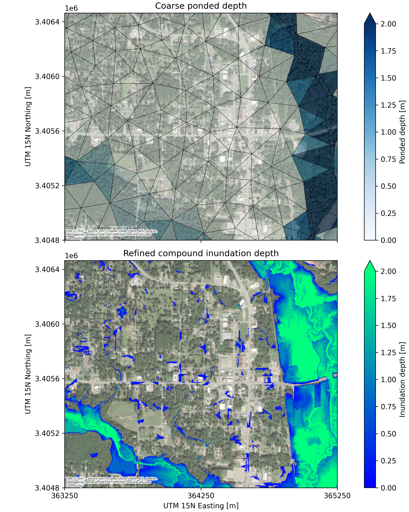

About
---

`depth-downscaler` refines ponded depth from coarse meshes ($\mathcal{O}(10^2)$ m) to high-resolution rasters ($\mathcal{O}(10^0)$ m) using a volume conservative method that separates fluvial and pluvial inundation components.



Installation
---

```bash
pip install git+https://github.com/passaH2O/depth-downscaler.git
```

To install a local development version:

```bash
git clone git@github.com:passaH2O/depth-downscaler.git
cd depth-downscaler
pip install -e .
```

Usage
---

See the example Jupyter notebooks in the `examples` folder.
1. `00_woodville_data.ipynb` shows how to obtain the input data for the downscaling example.
    - This notebook is not required to run the downscaling example.
2. `01_woodville_downscaling.ipynb` shows an example compound fluvial/pluvial downscaling workflow.

Citation
---

If you use `depth-downscaler` in your research, please cite this repository. A preprint describing the method is in preparation and this section will be updated once it is available.